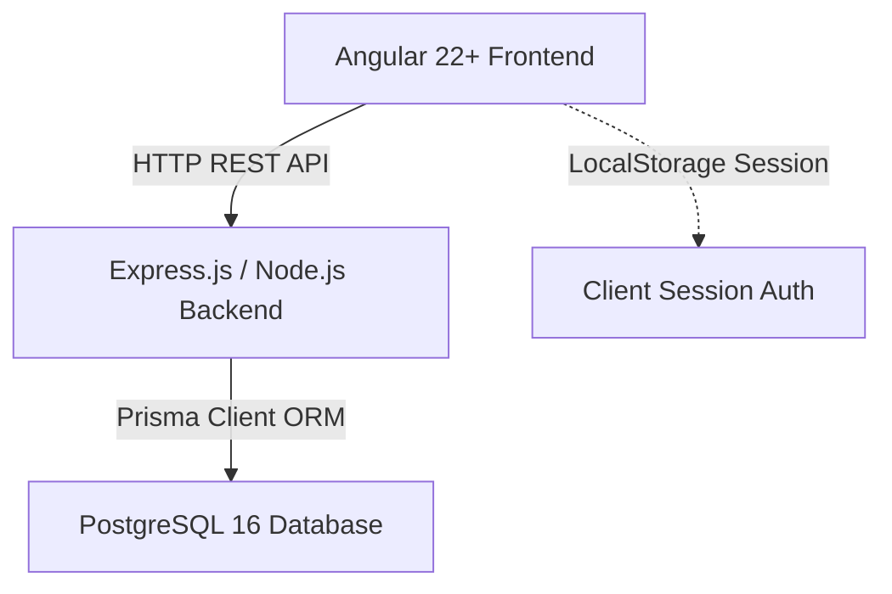
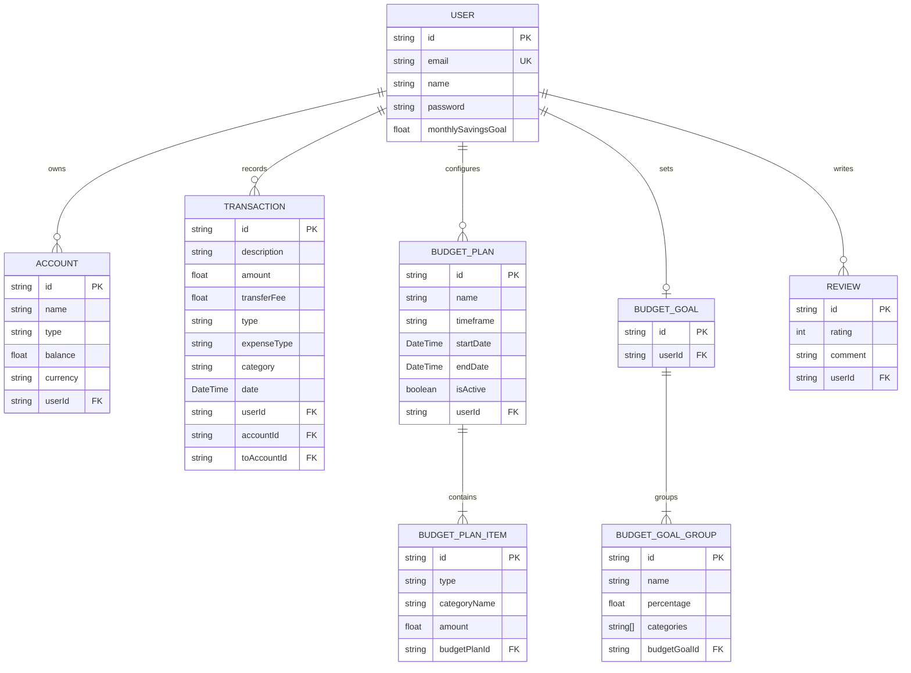

# FinTrack Design & Architecture Document

Welcome to the FinTrack design specification. This document outlines the project's technical architecture, user interface design decisions, database models, and communication layers.

---

## 1. Technical Stack Overview

FinTrack is built as a modular modern web application divided into two primary directories:

### Frontend
- **Framework**: Angular 22+ (Standalone Components, Signals API)
- **Styling**: Tailwind CSS 4 with a curated dark-slate glassmorphism aesthetic.
- **Routing**: Angular Router configured with secure client-side navigation.

### Backend
- **Framework**: Node.js with Express.js REST APIs.
- **ORM**: Prisma ORM.
- **Language**: TypeScript compiling to native Node.js ES modules.

### Database
- **Engine**: PostgreSQL 16.

---

## 2. Database Design & Models

The database is managed using Prisma. Below is the Entity-Relationship (ER) model layout of the database schema:

---

## 3. UI Design System & Guidelines

FinTrack employs a premium, highly dark-themed glassmorphism interface that matches modern application standards.

### Color Palette
- **Backgrounds**: Slate-950 (deep space void), Slate-900 (panel cards).
- **Accents**: Emerald-500 (interactive items & success), Amber-400 (warnings & configurations), Rose-500 (destructive actions & expenses).
- **Text**: White (headings), Slate-350/400 (body copy), Slate-500 (muted labels).

### Key Frontend Components
1. **Header Component**: Displays branding (`₮ FinTrack`), active user details, and controls for system triggers.
2. **Slider Menu**: Sliding side drawer panel that handles secondary functions (Password Reset, Write a Review, Log Out).
3. **Analytics Section (Dashboard)**:
   - Displays a dynamic CSS conic-gradient **Donut Chart** representing the actual monthly spent/saved breakdown.
   - Shows progress-to-goal metrics comparing actual transactions against baseline target allocations.
4. **Implementation Modal**: Automatically parses plan timeframes (e.g. 1st to 15th) to calculate execution boundaries behind the scenes, ensuring the UI remains simple and intuitive.
5. **Feedback & Reviews**: Star rating input and historical list with transition-effects.

---

## 4. REST API Routing Architecture

Modular Express routers mount under `/api`:

| Path prefix | Router file | Description |
|---|---|---|
| `/api/auth` | `auth.routes.ts` | Login, Registration, Password Resets |
| `/api/accounts` | `accounts.routes.ts` | CRUD endpoints for User Accounts & Balances |
| `/api/transactions`| `transactions.routes.ts`| Transaction logs, transfers, and savings records |
| `/api/reviews` | `reviews.routes.ts` | User reviews and rating submissions |
| `/api` | `budgets.routes.ts` | Budget Plans, implementation rules, and Goal group structures |
| `/api/refs` | `reference.routes.ts` | Pre-seeded read-only lookup data (Categories, Account Types) |

---

## 5. Security & Session Integrity

1. **Authentication**: Clear separation of endpoints. Angular frontend guards page routes using `AuthService`.
2. **Session Persistence**: Session parameters are cached locally in browser local storage and verified dynamically with the server.
3. **Database Cascading**: Transactions, accounts, budgets, and reviews are bound to specific `User` records with cascade delete options.
