# FinTrack Web — Master Technical Design Specification

This document provides the complete, unified technical design specification for the FinTrack Web project. It outlines the architecture, database schema, user stories, visual diagrams, API designs, and data models.

---

## 1. Technical stack architecture

FinTrack is built as a multi-tier web application designed for reliability and data consistency:

*   **Presentation layer (frontend)**: Built on Angular 22+ using standalone components and the Signals API for state synchronization. The interface uses a dark-slate glassmorphism style built with Tailwind CSS 4.
*   **API layer (backend)**: Built with Node.js and Express.js in TypeScript. All routes are grouped under `/api` prefixes.
*   **Data access layer**: Managed through Prisma Client ORM for type-safe database queries.
*   **Database engine**: PostgreSQL 16.
*   **Email service**: Nodemailer for sending verification codes.
*   **Fallback layer**: An in-memory store (`mockStore.ts`) acts as a fallback when database connections are offline, keeping the app working.

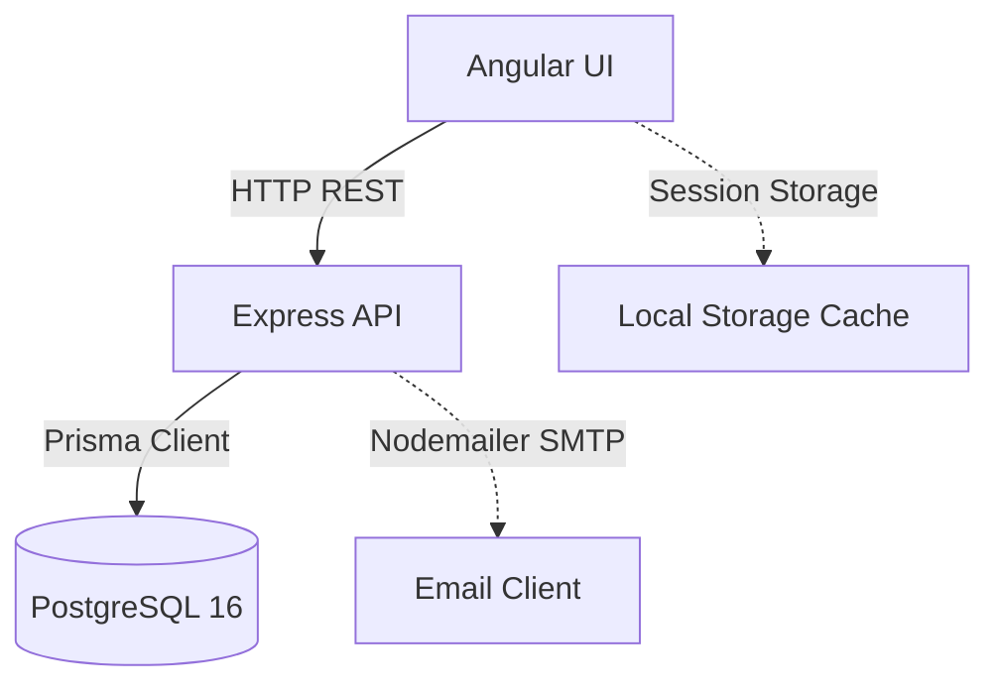

---

## 2. Detailed user stories

This section lists the user stories for all application modules.

### Module 1: User Authentication & Profile Security

*   **US#1.1 - Account Registration**
    *   **Description**: Visitor registers for a new profile.
    *   **User Story**: As a visitor, I want to register a new account so that I can save my financial data securely.
    *   **Acceptance Criteria**:
        1. **Purpose**: Registers a new user account profile in the system.
        2. **Operation**: Create operation.
        3. **Database Changes**: Inserts a new row in the `User` table.
        4. **Acceptance Criteria**:
           * Requires valid `name`, `email`, and `password` parameters.
           * Hashes the password string securely before database insertion.
           * Returns a `201 Created` status with the user details (excluding password) on success.
        5. **Error Scenarios**:
           * Returns `400 Bad Request` if duplicate email is found.
           * Returns `400 Bad Request` if name, email, or password parameters are missing.
           * Saves the record to the in-memory fallback store (`mockUsers`) if PostgreSQL is unreachable.

*   **US#1.2 - User Login**
    *   **Description**: Registered user logs in to access their session.
    *   **User Story**: As a registered user, I want to login with my credentials so that I can access my dashboard securely.
    *   **Acceptance Criteria**:
        1. **Purpose**: Authenticates credentials to establish a session.
        2. **Operation**: Read operation.
        3. **Database Changes**: None.
        4. **Acceptance Criteria**:
           * Requires `email` and `password` parameters.
           * Compares the input password directly with the stored password hash.
           * Returns a `200 OK` status with the user session metadata on success.
        5. **Error Scenarios**:
           * Returns `401 Unauthorized` if credentials do not match.
           * Returns `400 Bad Request` if email or password parameters are missing.

*   **US#1.3 - Forgot Password Request**
    *   **Description**: User requests a password reset code.
    *   **User Story**: As a user who forgot my password, I want to request a reset code so that I can verify my identity.
    *   **Acceptance Criteria**:
        1. **Purpose**: Generates and emails a verification code to authorize password modification.
        2. **Operation**: Create operation.
        3. **Database Changes**: None.
        4. **Acceptance Criteria**:
           * Requires a registered user `email`.
           * Generates a random 6-digit verification code.
           * Dispatches the code to the email address using Nodemailer SMTP.
        5. **Error Scenarios**:
           * Returns `404 Not Found` if the email address is not registered in the system.
           * Returns `500 Internal Server Error` if the SMTP transporter fails to send the email.

*   **US#1.4 - Otp Password Reset**
    *   **Description**: User resets password using the verification code.
    *   **User Story**: As a verified forgot-password applicant, I want to submit the verification code and my new password so that I can update my account password.
    *   **Acceptance Criteria**:
        1. **Purpose**: Resets the password for a user after verification.
        2. **Operation**: Update operation.
        3. **Database Changes**: Modifies the password string in the `User` record; removes the verification code key from memory.
        4. **Acceptance Criteria**:
           * Requires `email`, `otp`, and `newPassword` parameters.
           * Matches the submitted OTP with the cached code in memory.
           * Returns a `200 OK` status on success.
        5. **Error Scenarios**:
           * Returns `400 Bad Request` if the OTP is invalid or expired.
           * Returns `400 Bad Request` if email, otp, or newPassword parameters are missing.

*   **US#1.5 - Authenticated Change Password**
    *   **Description**: Logged-in user changes password.
    *   **User Story**: As a logged-in user, I want to change my current password from my settings so that I can keep my profile secure.
    *   **Acceptance Criteria**:
        1. **Purpose**: Updates password for an authenticated session.
        2. **Operation**: Update operation.
        3. **Database Changes**: Modifies the password string in the `User` record.
        4. **Acceptance Criteria**:
           * Requires `email`, `currentPassword`, and `newPassword` parameters.
           * Verifies that the current password matches the database record.
           * Returns a `200 OK` status on success.
        5. **Error Scenarios**:
           * Returns `400 Bad Request` if the current password is incorrect.
           * Returns `400 Bad Request` if parameters are missing.

---

### Module 2: Account Management

*   **US#2.1 - List Accounts**
    *   **Description**: User browses accounts.
    *   **User Story**: As a user, I want to view a list of all my financial accounts so that I can check their current balances.
    *   **Acceptance Criteria**:
        1. **Purpose**: Retrieves all financial accounts belonging to a user.
        2. **Operation**: Read operation.
        3. **Database Changes**: None.
        4. **Acceptance Criteria**:
           * Retrieves user accounts filtered by `userId`.
           * Orders the list by `updatedDate` descending.
           * Returns a `200 OK` status on success.
        5. **Error Scenarios**:
           * Returns in-memory fallback mock accounts if database query fails.

*   **US#2.2 - Create Account**
    *   **Description**: User adds a new cash or bank repository.
    *   **User Story**: As a user, I want to create a new financial account so that I can manage my cash and bank balances.
    *   **Acceptance Criteria**:
        1. **Purpose**: Creates a new financial repository for the user.
        2. **Operation**: Create operation.
        3. **Database Changes**: Inserts a new row in the `Account` table.
        4. **Acceptance Criteria**:
           * Requires `name` and `type` parameters.
           * Restricts the account type to CASH, BANK, CREDIT, SAVINGS, or E_WALLET.
           * Sets the default currency to "PHP" if it is left blank.
           * Returns a `201 Created` status on success.
        5. **Error Scenarios**:
           * Returns `400 Bad Request` if the account type is invalid.
           * Returns `400 Bad Request` if name or type parameters are missing.

*   **US#2.3 - Update Account**
    *   **Description**: User modifies account details.
    *   **User Story**: As a user, I want to modify my account configurations so that I can update its name, type, or balance.
    *   **Acceptance Criteria**:
        1. **Purpose**: Updates account details and handles balance adjustments.
        2. **Operation**: Update operation (modifies `Account` record) and Create operation (writes adjustment transaction if needed).
        3. **Database Changes**: Modifies fields in the `Account` table; inserts a row in the `Transaction` table if the balance is changed.
        4. **Acceptance Criteria**:
           * Updates name and type fields.
           * If the new balance is different from the old balance, creates an automatic balancing transaction (category: "Adjustment", type: INCOME if balance increased, EXPENSE if decreased).
           * Returns a `200 OK` status on success.
        5. **Error Scenarios**:
           * Returns `404 Not Found` if the account ID does not exist.

*   **US#2.4 - Delete Account**
    *   **Description**: User removes an account.
    *   **User Story**: As a user, I want to delete an inactive account so that I can keep my account list clean.
    *   **Acceptance Criteria**:
        1. **Purpose**: Removes a financial repository from the database.
        2. **Operation**: Delete operation.
        3. **Database Changes**: Deletes the row in the `Account` table.
        4. **Acceptance Criteria**:
           * Blocks deletion if the account balance is not exactly 0.0.
           * Returns a `200 OK` status on success.
        5. **Error Scenarios**:
           * Returns `400 Bad Request` if the account balance is not zero.
           * Returns `404 Not Found` if the account ID does not exist.

---

### Module 3: Transactions

*   **US#3.1 - Get Transaction List**
    *   **Description**: User browses the transaction history ledger.
    *   **User Story**: As a user, I want to view my transaction ledger so that I can track my historical records.
    *   **Acceptance Criteria**:
        1. **Purpose**: Retrieves the list of user transactions.
        2. **Operation**: Read operation.
        3. **Database Changes**: None.
        4. **Acceptance Criteria**:
           * Retrieves user transactions filtered by `userId`.
           * Orders the list by `date` descending.
           * Returns a `200 OK` status on success.
        5. **Error Scenarios**:
           * Returns an empty array if no transactions exist.

*   **US#3.2 - Create Transaction**
    *   **Description**: User records a new generic ledger transaction.
    *   **User Story**: As a user, I want to create a new transaction so that my account balances update automatically.
    *   **Acceptance Criteria**:
        1. **Purpose**: Records a transaction and updates the account balance.
        2. **Operation**: Create operation (inserts `Transaction` record) and Update operation (adjusts balance).
        3. **Database Changes**: Inserts a row in the `Transaction` table; updates the balance value in the `Account` table.
        4. **Acceptance Criteria**:
           * Requires `description`, `amount`, and transaction `type` parameters.
           * Restricts non-credit source accounts from going negative.
           * Adjusts account balances based on transaction type (INCOME increases balance, EXPENSE decreases it).
           * Returns a `201 Created` status on success.
        5. **Error Scenarios**:
           * Returns `400 Bad Request` if a non-credit account has insufficient balance.
           * Returns `400 Bad Request` if description, amount, or type parameters are missing.

*   **US#3.3 - Update Transaction**
    *   **Description**: User modifies transaction details.
    *   **User Story**: As a user, I want to edit a transaction detail so that I can correct errors.
    *   **Acceptance Criteria**:
        1. **Purpose**: Modifies transaction information.
        2. **Operation**: Update operation.
        3. **Database Changes**: Modifies the row in the `Transaction` table.
        4. **Acceptance Criteria**:
           * Updates `description`, `category`, `amount`, `accountId`, or `expenseDate` fields.
           * Returns a `200 OK` status on success.
        5. **Error Scenarios**:
           * Returns `404 Not Found` if the transaction ID does not exist.

*   **US#3.4 - Delete Transaction**
    *   **Description**: User removes a transaction.
    *   **User Story**: As a user, I want to delete a transaction so that my account balances are restored automatically.
    *   **Acceptance Criteria**:
        1. **Purpose**: Removes a transaction and rolls back its balance change.
        2. **Operation**: Delete operation (removes `Transaction` record) and Update operation (adjusts balance).
        3. **Database Changes**: Deletes the row in the `Transaction` table; updates balance values in the `Account` table.
        4. **Acceptance Criteria**:
           * Reverses the balance change of the transaction on affected accounts.
           * Runs the deletion and rollback together inside a database transaction block.
           * Returns a `200 OK` status on success.
        5. **Error Scenarios**:
           * Returns `404 Not Found` if the transaction ID does not exist.

*   **US#3.5 - Bulk Delete Transactions**
    *   **Description**: User deletes multiple transactions at once.
    *   **User Story**: As a user, I want to delete multiple transactions in one operation so that I can clean up my dashboard ledger.
    *   **Acceptance Criteria**:
        1. **Purpose**: Deletes multiple transactions and rolls back balances in a single operation.
        2. **Operation**: Delete operation (removes multiple records) and Update operation (adjusts multiple balances).
        3. **Database Changes**: Deletes selected rows in the `Transaction` table; updates balance values in the `Account` table.
        4. **Acceptance Criteria**:
           * Accepts an array of transaction IDs.
           * Performs sequential balance rollbacks and deletes all selected records in a single database transaction.
           * Returns a `200 OK` status on success.
        5. **Error Scenarios**:
           * Returns `400 Bad Request` if the transaction IDs payload is missing or is not a valid array.

---

### Module 4: Budget Plan & Goals

*   **US#4.1 - List Budget Plans**
    *   **Description**: User lists budget templates.
    *   **User Story**: As a user, I want to view my budget plans so that I can compare my templates.
    *   **Acceptance Criteria**:
        1. **Purpose**: Retrieves all budget plans configured by the user.
        2. **Operation**: Read operation.
        3. **Database Changes**: None.
        4. **Acceptance Criteria**:
           * Retrieves budget plans filtered by `userId`.
           * Returns each plan along with its child budget line items.
           * Returns a `200 OK` status on success.
        5. **Error Scenarios**:
           * Returns empty list if no plans are found.

*   **US#4.2 - Create Budget Plan**
    *   **Description**: User designs a new budget template.
    *   **User Story**: As a user, I want to create a new budget plan so that I can allocate my expected income and expenses.
    *   **Acceptance Criteria**:
        1. **Purpose**: Designs a new budget template.
        2. **Operation**: Create operation.
        3. **Database Changes**: Inserts a new row in the `BudgetPlan` table; inserts multiple rows in the `BudgetPlanItem` table.
        4. **Acceptance Criteria**:
           * Requires a budget plan `name` and `timeframe` configuration.
           * Saves timeframe details as a JSON string.
           * Creates child budget item records containing category, type, and projected amount.
           * Returns a `201 Created` status on success.
        5. **Error Scenarios**:
           * Returns `400 Bad Request` if name or timeframe parameters are missing.

*   **US#4.3 - Update Budget Plan**
    *   **Description**: User updates an existing budget template.
    *   **User Story**: As a user, I want to update my budget plan so that I can modify expected values and line items.
    *   **Acceptance Criteria**:
        1. **Purpose**: Updates an existing budget template.
        2. **Operation**: Update operation (modifies `BudgetPlan` record), Delete operation (clears previous items), and Create operation (adds new items).
        3. **Database Changes**: Updates the row in the `BudgetPlan` table; deletes and inserts rows in the `BudgetPlanItem` table.
        4. **Acceptance Criteria**:
           * Deletes previous line items and inserts the new list inside a transaction to keep data clean.
           * Updates budget plan properties (name, timeframe).
           * Returns a `200 OK` status on success.
        5. **Error Scenarios**:
           * Returns `404 Not Found` if the budget plan ID does not exist.

*   **US#4.4 - Delete Budget Plan**
    *   **Description**: User removes a budget template.
    *   **User Story**: As a user, I want to delete an old budget plan so that I can remove obsolete templates.
    *   **Acceptance Criteria**:
        1. **Purpose**: Removes a budget plan template.
        2. **Operation**: Delete operation.
        3. **Database Changes**: Deletes the row in the `BudgetPlan` table; cascading rules delete associated items in the `BudgetPlanItem` table.
        4. **Acceptance Criteria**:
           * Deletes the plan from the database.
           * Returns a `200 OK` status on success.
        5. **Error Scenarios**:
           * Returns `404 Not Found` if the budget plan ID does not exist.

*   **US#4.5 - Activate Budget Plan**
    *   **Description**: User activates a budget template for a active timeframe.
    *   **User Story**: As a user, I want to activate a budget template so that all projected income, transfers, and expenses are posted to my ledger automatically.
    *   **Acceptance Criteria**:
        1. **Purpose**: Activates a budget blueprint for a active timeframe and generates actual ledger transactions.
        2. **Operation**: Update operation (sets active status) and Create operation (adds multiple transactions).
        3. **Database Changes**: Updates active flags in the `BudgetPlan` table; inserts rows in the `Transaction` table; updates balances in the `Account` table.
        4. **Acceptance Criteria**:
           * Requires `startDate`, `endDate`, and primary `accountId` parameters.
           * Set other user budget plans to inactive.
           * Iterates over budget plan items and creates actual transaction records in the ledger.
           * Updates account balances. Writes transfer fees as separate expense transactions.
           * Returns a `200 OK` status on success.
        5. **Error Scenarios**:
           * Returns `400 Bad Request` if startDate, endDate, or accountId parameters are missing.
           * Returns `404 Not Found` if the plan ID does not exist.

*   **US#4.6 - Deactivate Budget Plan**
    *   **Description**: User deactivates the active budget plan.
    *   **User Story**: As a user, I want to deactivate my active budget plan so that I can stop comparisons.
    *   **Acceptance Criteria**:
        1. **Purpose**: Deactivates the active budget plan.
        2. **Operation**: Update operation.
        3. **Database Changes**: Sets the `isActive` flag to false.
        4. **Acceptance Criteria**:
           * Resets the active flag on the plan.
           * Returns a `200 OK` status on success.
        5. **Error Scenarios**:
           * Returns `404 Not Found` if the plan ID does not exist.

*   **US#4.7 - Get Budget Goals**
    *   **Description**: User views target allocations.
    *   **User Story**: As a user, I want to view my budget goals so that I can see target percentages for my category groups.
    *   **Acceptance Criteria**:
        1. **Purpose**: Retrieves target budget allocation groups.
        2. **Operation**: Read operation.
        3. **Database Changes**: None.
        4. **Acceptance Criteria**:
           * Retrieves allocations filtered by `userId`.
           * Returns target percentage groupings with their categories.
           * Returns a `200 OK` status on success.
        5. **Error Scenarios**:
           * Returns default empty groups if goals have not been set.

*   **US#4.8 - Update Budget Goals**
    *   **Description**: User sets target percentage groupings.
    *   **User Story**: As a user, I want to update my budget goals so that I can define allocation percentages for essentials, leisure, and savings.
    *   **Acceptance Criteria**:
        1. **Purpose**: Configures target percentage groupings for categories.
        2. **Operation**: Delete operation (clears previous groups), Create operation (inserts new groups), and Update operation (finds or creates main goal record).
        3. **Database Changes**: Deletes and inserts rows in the `BudgetGoalGroup` table; inserts a row in the `BudgetGoal` table if it is missing.
        4. **Acceptance Criteria**:
           * Requires a list of target `groups` with names, percentages, and categories.
           * Replaces previous goals with the new configuration inside a transaction.
           * Returns a `200 OK` status on success.
        5. **Error Scenarios**:
           * Returns `400 Bad Request` if the groups payload is missing or invalid.

---

### Module 5: Savings

*   **US#5.1 - Get Savings List**
    *   **Description**: User browses savings logs.
    *   **User Story**: As a user, I want to view my savings list so that I can track my deposits.
    *   **Acceptance Criteria**:
        1. **Purpose**: Retrieves savings transaction records.
        2. **Operation**: Read operation.
        3. **Database Changes**: None.
        4. **Acceptance Criteria**:
           * Retrieves user transactions filtered by `userId` and type = `SAVINGS`.
           * Returns a `200 OK` status on success.
        5. **Error Scenarios**:
           * Returns empty list if no savings records are found.

*   **US#5.2 - Create Savings Transaction**
    *   **Description**: User records a savings deposit.
    *   **User Story**: As a user, I want to create a savings transaction so that I can transfer funds to my savings balance.
    *   **Acceptance Criteria**:
        1. **Purpose**: Records a savings deposit and updates balances.
        2. **Operation**: Create operation (inserts `Transaction` record) and Update operation (adjusts balances).
        3. **Database Changes**: Adds a row in the `Transaction` table; updates balance values in the `Account` table.
        4. **Acceptance Criteria**:
           * Requires `description`, `amount`, and source `accountId` parameters.
           * Checks that the source account has sufficient funds before allowing the deposit.
           * Deducts the amount from the source account and adds it to the savings destination account.
           * Returns a `201 Created` status on success.
        5. **Error Scenarios**:
           * Returns `400 Bad Request` if the source account goes negative.
           * Returns `400 Bad Request` if description, amount, or accountId parameters are missing.

*   **US#5.3 - Update Savings Transaction**
    *   **Description**: User modifies savings details.
    *   **User Story**: As a user, I want to update my savings transaction details so that I can correct errors.
    *   **Acceptance Criteria**:
        1. **Purpose**: Modifies savings deposit details.
        2. **Operation**: Update operation (modifies `Transaction` record) and Update operation (recalculates affected balances).
        3. **Database Changes**: Updates the row in the `Transaction` table; updates balance values in the `Account` table.
        4. **Acceptance Criteria**:
           * Re-calculates and updates balances inside a database transaction to keep balances consistent.
           * Returns a `200 OK` status on success.
        5. **Error Scenarios**:
           * Returns `404 Not Found` if the transaction ID does not exist.

*   **US#5.4 - Delete Savings Transaction**
    *   **Description**: User removes a savings record.
    *   **User Story**: As a user, I want to delete a savings transaction so that my balances are restored.
    *   **Acceptance Criteria**:
        1. **Purpose**: Removes a savings transaction and restores balances.
        2. **Operation**: Delete operation (removes `Transaction` record) and Update operation (adjusts account balances).
        3. **Database Changes**: Deletes the row in the `Transaction` table; updates balance values in the `Account` table.
        4. **Acceptance Criteria**:
           * Reverts balances by adding the amount back to the source account and deducting it from the destination savings account.
           * Runs the deletion and rollback together inside a transaction block.
           * Returns a `200 OK` status on success.
        5. **Error Scenarios**:
           * Returns `404 Not Found` if the transaction ID does not exist.

*   **US#5.5 - Bulk Delete Savings Transactions**
    *   **Description**: User deletes multiple savings records.
    *   **User Story**: As a user, I want to delete multiple savings transactions in one operation so that I can clear outdated logs.
    *   **Acceptance Criteria**:
        1. **Purpose**: Deletes multiple savings transactions and restores balances.
        2. **Operation**: Delete operation (removes multiple records) and Update operation (adjusts multiple account balances).
        3. **Database Changes**: Deletes selected rows in the `Transaction` table; updates balance values in the `Account` table.
        4. **Acceptance Criteria**:
           * Performs balance rollbacks and deletes all selected entries in a single database transaction.
           * Returns a `200 OK` status on success.
        5. **Error Scenarios**:
           * Returns `400 Bad Request` if the payload is not a valid array of IDs.

*   **US#5.6 - Get Monthly Savings Goal**
    *   **Description**: User views target savings goal.
    *   **User Story**: As a user, I want to view my monthly savings goal so that I can monitor my target limits.
    *   **Acceptance Criteria**:
        1. **Purpose**: Retrieves the monthly savings target limit.
        2. **Operation**: Read operation.
        3. **Database Changes**: None.
        4. **Acceptance Criteria**:
           * Returns the monthly target savings value for the user from User database profile.
           * Returns a `200 OK` status on success.
        5. **Error Scenarios**:
           * Returns 0.0 if the monthly savings goal is not yet initialized.

*   **US#5.7 - Update Monthly Savings Goal**
    *   **Description**: User modifies savings goal.
    *   **User Story**: As a user, I want to update my monthly savings goal so that I can adjust my savings target limit.
    *   **Acceptance Criteria**:
        1. **Purpose**: Updates the monthly savings target limit.
        2. **Operation**: Update operation.
        3. **Database Changes**: Updates the `monthlySavingsGoal` float value in the `User` table.
        4. **Acceptance Criteria**:
           * Requires a numeric `monthlySavingsGoal` parameter.
           * Updates the target in the user's record.
           * Returns a `200 OK` status on success.
        5. **Error Scenarios**:
           * Returns `400 Bad Request` if the savings goal value is not a valid number.

---

### Module 6: Incomes

*   **US#6.1 - Get Incomes List**
    *   **Description**: User browses income history.
    *   **User Story**: As a user, I want to view my incomes list so that I can monitor my salary and freelance gig logs.
    *   **Acceptance Criteria**:
        1. **Purpose**: Retrieves income records.
        2. **Operation**: Read operation.
        3. **Database Changes**: None.
        4. **Acceptance Criteria**:
           * Retrieves user transactions filtered by `userId` and type = `INCOME`.
           * Returns a `200 OK` status on success.
        5. **Error Scenarios**:
           * Returns empty list if no income records are found.

*   **US#6.2 - Create Income Transaction**
    *   **Description**: User records income.
    *   **User Story**: As a user, I want to create an income transaction so that my balance is updated.
    *   **Acceptance Criteria**:
        1. **Purpose**: Records incoming funds and updates the account balance.
        2. **Operation**: Create operation (inserts `Transaction` record) and Update operation (adjusts balance).
        3. **Database Changes**: Adds a row in the `Transaction` table; updates the balance value in the `Account` table.
        4. **Acceptance Criteria**:
           * Requires `description`, `amount`, and target `accountId` parameters.
           * Adds the income amount to the account balance.
           * Records the entry under the INCOME type.
           * Returns a `201 Created` status on success.
        5. **Error Scenarios**:
           * Returns `400 Bad Request` if description, amount, or accountId parameters are missing.

*   **US#6.3 - Update Income Transaction**
    *   **Description**: User modifies income details.
    *   **User Story**: As a user, I want to update my income transaction details so that I can correct errors.
    *   **Acceptance Criteria**:
        1. **Purpose**: Modifies income details.
        2. **Operation**: Update operation (modifies `Transaction` record) and Update operation (recalculates affected balance).
        3. **Database Changes**: Updates the row in the `Transaction` table; updates the balance value in the `Account` table.
        4. **Acceptance Criteria**:
           * Updates income values and adjusts the account balance in a database transaction.
           * Returns a `200 OK` status on success.
        5. **Error Scenarios**:
           * Returns `404 Not Found` if the transaction ID does not exist.

*   **US#6.4 - Delete Income Transaction**
    *   **Description**: User removes an income record.
    *   **User Story**: As a user, I want to delete an income transaction so that my balance is adjusted.
    *   **Acceptance Criteria**:
        1. **Purpose**: Removes an income record and adjusts the balance.
        2. **Operation**: Delete operation (removes `Transaction` record) and Update operation (adjusts balance).
        3. **Database Changes**: Deletes the row in the `Transaction` table; updates the balance value in the `Account` table.
        4. **Acceptance Criteria**:
           * Deducts the income amount from the target account balance to execute rollback.
           * Runs the deletion and rollback together inside a transaction block.
           * Returns a `200 OK` status on success.
        5. **Error Scenarios**:
           * Returns `404 Not Found` if the transaction ID does not exist.

*   **US#6.5 - Bulk Delete Income Transactions**
    *   **Description**: User deletes multiple incomes.
    *   **User Story**: As a user, I want to delete multiple income transactions in one operation so that I can clear outdated logs.
    *   **Acceptance Criteria**:
        1. **Purpose**: Deletes multiple income records and adjusts balances.
        2. **Operation**: Delete operation (removes multiple records) and Update operation (adjusts multiple account balances).
        3. **Database Changes**: Deletes selected rows in the `Transaction` table; updates balance values in the `Account` table.
        4. **Acceptance Criteria**:
           * Deducts balances and deletes all selected entries inside a single database transaction.
           * Returns a `200 OK` status on success.
        5. **Error Scenarios**:
           * Returns `400 Bad Request` if the payload is not a valid array of IDs.

---

### Module 7: Expenses

*   **US#7.1 - Get Expenses List**
    *   **Description**: User views expenses.
    *   **User Story**: As a user, I want to view my expenses list so that I can monitor my expenditures.
    *   **Acceptance Criteria**:
        1. **Purpose**: Retrieves expense records.
        2. **Operation**: Read operation.
        3. **Database Changes**: None.
        4. **Acceptance Criteria**:
           * Retrieves user transactions filtered by `userId` and type = `EXPENSE`.
           * Returns a `200 OK` status on success.
        5. **Error Scenarios**:
           * Returns empty list if no expense records are found.

*   **US#7.2 - Create Expense Transaction**
    *   **Description**: User records an expense.
    *   **User Story**: As a user, I want to create an expense transaction so that my balance is updated.
    *   **Acceptance Criteria**:
        1. **Purpose**: Records an expense and updates the account balance.
        2. **Operation**: Create operation (inserts `Transaction` record) and Update operation (adjusts balance).
        3. **Database Changes**: Adds a row in the `Transaction` table; updates the balance value in the `Account` table.
        4. **Acceptance Criteria**:
           * Requires `description`, `amount`, and source `accountId` parameters.
           * Checks that the account has sufficient funds (unless it is a CREDIT account) before posting.
           * Deducts the amount from the account balance.
           * Returns a `201 Created` status on success.
        5. **Error Scenarios**:
           * Returns `400 Bad Request` if a non-credit account has insufficient balance.
           * Returns `400 Bad Request` if description, amount, or accountId parameters are missing.

*   **US#7.3 - Update Expense Transaction**
    *   **Description**: User modifies expense details.
    *   **User Story**: As a user, I want to update my expense transaction details so that I can correct errors.
    *   **Acceptance Criteria**:
        1. **Purpose**: Modifies expense details.
        2. **Operation**: Update operation (modifies `Transaction` record) and Update operation (recalculates affected balance).
        3. **Database Changes**: Updates the row in the `Transaction` table; updates the balance value in the `Account` table.
        4. **Acceptance Criteria**:
           * Updates description, amount, or category, and adjusts account balances inside a transaction.
           * Returns a `200 OK` status on success.
        5. **Error Scenarios**:
           * Returns `404 Not Found` if the transaction ID does not exist.

*   **US#7.4 - Delete Expense Transaction**
    *   **Description**: User removes an expense record.
    *   **User Story**: As a user, I want to delete an expense transaction so that my balance is restored.
    *   **Acceptance Criteria**:
        1. **Purpose**: Removes an expense record and restores the balance.
        2. **Operation**: Delete operation (removes `Transaction` record) and Update operation (adjusts balance).
        3. **Database Changes**: Deletes the row in the `Transaction` table; updates the balance value in the `Account` table.
        4. **Acceptance Criteria**:
           * Adds the transaction amount back to the account balance to restore the funds.
           * Runs the deletion and rollback together inside a transaction block.
           * Returns a `200 OK` status on success.
        5. **Error Scenarios**:
           * Returns `404 Not Found` if the transaction ID does not exist.

*   **US#7.5 - Bulk Delete Expense Transactions**
    *   **Description**: User deletes multiple expenses.
    *   **User Story**: As a user, I want to delete multiple expense transactions in one operation so that I can clear outdated logs.
    *   **Acceptance Criteria**:
        1. **Purpose**: Deletes multiple expense records and restores balances.
        2. **Operation**: Delete operation (removes multiple records) and Update operation (adjusts multiple account balances).
        3. **Database Changes**: Deletes selected rows in the `Transaction` table; updates balance values in the `Account` table.
        4. **Acceptance Criteria**:
           * Restores balances and deletes selected expense entries in a single database transaction.
           * Returns a `200 OK` status on success.
        5. **Error Scenarios**:
           * Returns `400 Bad Request` if the payload is not a valid array of IDs.

---

### Module 8: Reference, Feedbacks, and Themes

*   **US#8.1 - Read Categories And Types**
    *   **Description**: User accesses pre-seeded values.
    *   **User Story**: As a user, I want to read categories and account types so that I can select them in form fields.
    *   **Acceptance Criteria**:
        1. **Purpose**: Retrieves static categories, account types, and recurrence intervals.
        2. **Operation**: Read operation.
        3. **Database Changes**: None.
        4. **Acceptance Criteria**:
           * Retrieves income, expense, savings categories, account types, and intervals.
           * Returns a `200 OK` status with the reference data on success.
        5. **Error Scenarios**:
           * Returns seeded default JSON array values if reference tables in database are unseeded.

*   **US#8.2 - Add Custom Category**
    *   **Description**: User adds custom category.
    *   **User Story**: As a user, I want to create a custom category so that I can categorize my records differently.
    *   **Acceptance Criteria**:
        1. **Purpose**: Adds a custom category to the reference list.
        2. **Operation**: Create operation.
        3. **Database Changes**: Adds a row in the category reference table.
        4. **Acceptance Criteria**:
           * Requires a category `name` parameter.
           * Inserts the category into the reference database.
           * Returns a `201 Created` status with the category on success.
        5. **Error Scenarios**:
           * Returns `400 Bad Request` if the name parameter is missing.

*   **US#8.3 - Modify Category Config**
    *   **Description**: User renames category.
    *   **User Story**: As a user, I want to rename a custom category so that I can adjust its labels.
    *   **Acceptance Criteria**:
        1. **Purpose**: Renames a custom category.
        2. **Operation**: Update operation.
        3. **Database Changes**: Updates the name field in the reference table.
        4. **Acceptance Criteria**:
           * Requires the new category `name` parameter.
           * Updates the name in the database.
           * Returns a `200 OK` status on success.
        5. **Error Scenarios**:
           * Returns `404 Not Found` if the category ID does not exist.

*   **US#8.4 - Delete Category**
    *   **Description**: User deletes a custom category.
    *   **User Story**: As a user, I want to delete a custom category so that I can remove it from my selectors.
    *   **Acceptance Criteria**:
        1. **Purpose**: Removes a custom category from the reference list.
        2. **Operation**: Delete operation.
        3. **Database Changes**: Deletes the row in the reference table.
        4. **Acceptance Criteria**:
           * Checks if the category name is currently used by any transactions.
           * Deletes the category if it is not in use.
           * Returns a `200 OK` status on success.
        5. **Error Scenarios**:
           * Returns `400 Bad Request` if the category is currently in use.
           * Returns `404 Not Found` if the category ID does not exist.

*   **US#8.5 - Fetch User Reviews**
    *   **Description**: User reads reviews feedback.
    *   **User Story**: As a user, I want to read feedback reviews so that I can read comments from other users.
    *   **Acceptance Criteria**:
        1. **Purpose**: Retrieves feedback submitted by users.
        2. **Operation**: Read operation.
        3. **Database Changes**: None.
        4. **Acceptance Criteria**:
           * Returns a list of user reviews sorted by creation date descending.
           * Returns a `200 OK` status on success.
        5. **Error Scenarios**:
           * Returns an empty list if no reviews have been submitted.

*   **US#8.6 - Write App Review**
    *   **Description**: User submits feedback rating.
    *   **User Story**: As a user, I want to submit feedback and rating so that I can share my experience.
    *   **Acceptance Criteria**:
        1. **Purpose**: Submits user feedback and a star rating.
        2. **Operation**: Create operation.
        3. **Database Changes**: Adds a row in the `Review` table.
        4. **Acceptance Criteria**:
           * Requires a `rating` score between 1 and 5 and a text `comment` parameter.
           * Validates that the submitting user exists in User database profile.
           * Returns a `200 OK` status on success.
        5. **Error Scenarios**:
           * Returns `400 Bad Request` if the rating is not an integer between 1 and 5.
           * Returns `400 Bad Request` if rating or comment parameters are missing.

*   **US#8.7 - Toggle Theme**
    *   **Description**: User toggles theme stylesheet modes.
    *   **User Story**: As a user, I want to switch between light and dark modes so that I can view the app in my preferred style.
    *   **Acceptance Criteria**:
        1. **Purpose**: Switches the user interface styling theme.
        2. **Operation**: Update operation (visual configuration).
        3. **Database Changes**: None.
        4. **Acceptance Criteria**:
           * Switches the UI styling between light and dark modes.
           * Stores the selection in browser local storage so it persists across visits.
        5. **Error Scenarios**:
           * Reverts to system default (dark mode) if local storage fails to resolve configuration.

---

### Module 9: Financial Dashboard

*   **US#9.1 - View Net Worth And Financial Summaries**
    *   **Description**: User views their total net worth, current month's total income, expenses, and savings.
    *   **User Story**: As a user, I want to view my net worth and monthly financial summaries on the dashboard so that I can get a quick overview of my financial status.
    *   **Acceptance Criteria**:
        1. **Purpose**: Computes and displays total net worth, monthly income, monthly expenses, and monthly savings.
        2. **Operation**: Read operation.
        3. **Database Changes**: None.
        4. **Acceptance Criteria**:
           * Computes net worth dynamically by summing up all asset balances and subtracting credit card balances.
           * Automatically filters income, expenses, and savings transactions to the current calendar month.
           * Refreshes totals when transactions or accounts are modified.
           * Returns a `200 OK` status with the dashboard data.
        5. **Error Scenarios**:
           * Displays zero balances if the user has no accounts or transactions recorded.

*   **US#9.2 - Toggle Net Worth Assets**
    *   **Description**: User toggles which accounts to include in their net worth calculation.
    *   **User Story**: As a user, I want to toggle whether my credit card debt or savings balances are included in my net worth calculation so that I can customize my net worth view.
    *   **Acceptance Criteria**:
        1. **Purpose**: Enables toggling of asset/liability inclusion settings.
        2. **Operation**: Update operation (visual configuration).
        3. **Database Changes**: None (stored in browser local storage).
        4. **Acceptance Criteria**:
           * Toggling "Include Savings" updates the net worth calculation to exclude savings account balances.
           * Toggling "Include Credit Cards" updates the net worth calculation to subtract credit card balances.
           * Persists toggle preferences in browser local storage to preserve state across page reloads.
        5. **Error Scenarios**:
           * Restores default preferences (include savings, exclude credit card) if local storage fails to resolve configuration.

*   **US#9.3 - Monitor Savings Goal Progress**
    *   **Description**: User monitors their progress toward their monthly savings goal.
    *   **User Story**: As a user, I want to see my monthly savings progress bar compared to my savings goal so that I can stay motivated to save.
    *   **Acceptance Criteria**:
        1. **Purpose**: Displays progress percentage toward the monthly savings goal.
        2. **Operation**: Read operation.
        3. **Database Changes**: None.
        4. **Acceptance Criteria**:
           * Calculates the progress percentage: `(currentMonthSavings / monthlySavingsGoal) * 100`.
           * Renders a progress bar that caps at 100%.
           * Hides the progress bar or shows a descriptive message if the monthly savings goal is 0.0 or not set.
        5. **Error Scenarios**:
           * If monthlySavingsGoal is 0 or negative, sets progress percentage to 0 to prevent division by zero errors.

*   **US#9.4 - View Goal Allocation Analytics**
    *   **Description**: User views their budget category allocations against target percentages.
    *   **User Story**: As a user, I want to see a breakdown of my actual spending versus my target budget goals so that I can see if I am staying within my limits.
    *   **Acceptance Criteria**:
        1. **Purpose**: Compares actual category expenses/savings against target goal percentages.
        2. **Operation**: Read operation.
        3. **Database Changes**: None.
        4. **Acceptance Criteria**:
           * Maps actual transaction categories to the corresponding goal groups (e.g. Essentials, Leisure, Savings).
           * Renders the comparison as target percentage vs. actual percentage of total monthly income.
           * Renders a warning style if the actual spending percentage exceeds the target goal percentage.
        5. **Error Scenarios**:
           * If total monthly income is 0, defaults target/actual comparison bases to 1.0 to prevent division by zero errors.

---

## 3. Visual diagrams

### 3.1 Sequence diagrams (per module)

#### Module 1: User authentication and profile security
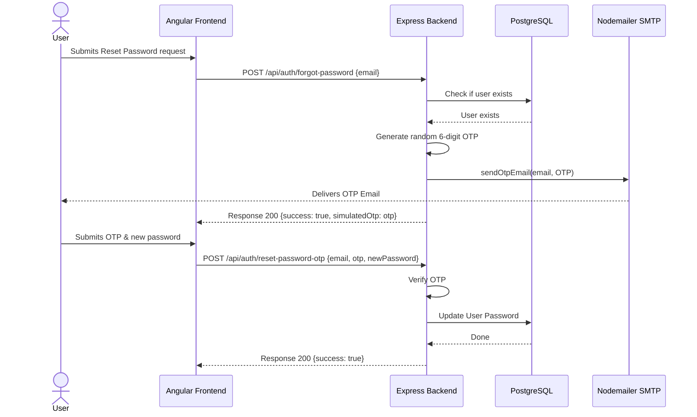

#### Module 2: Account management
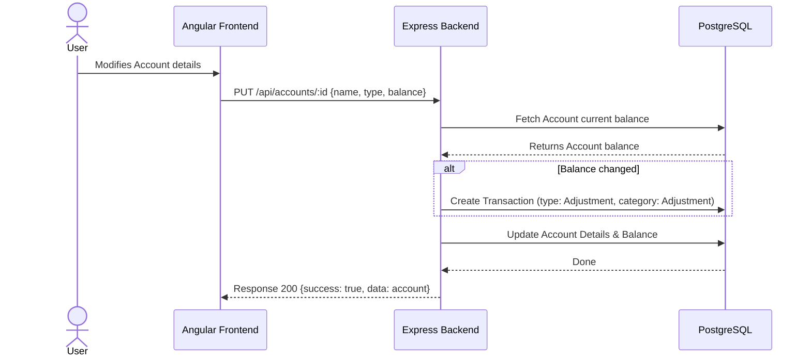

#### Module 3: Transactions
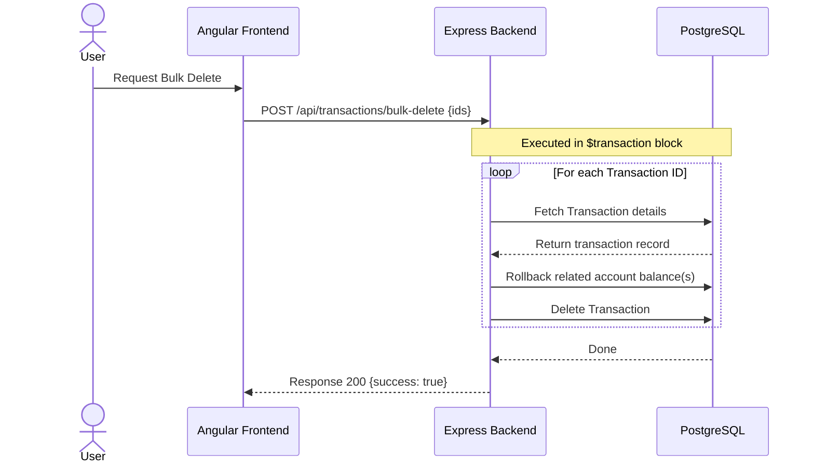

#### Module 4: Budget plan and goals
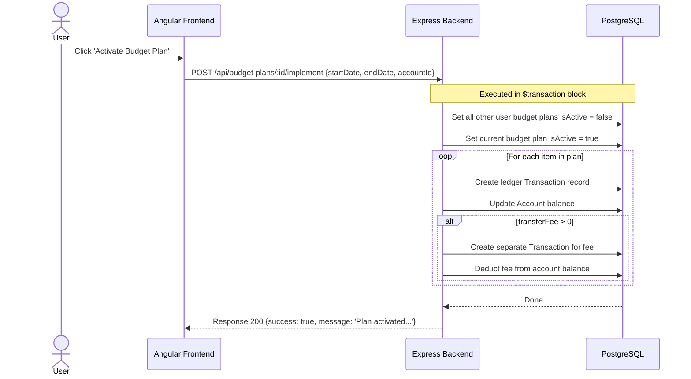

#### Module 5: Savings
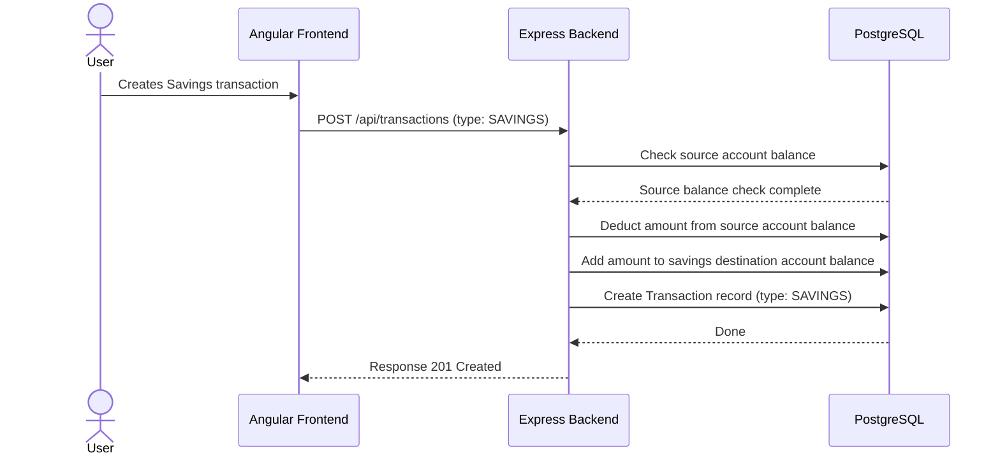

#### Module 6: Incomes
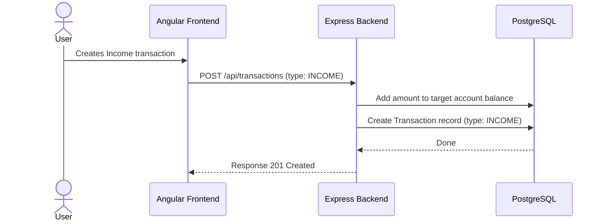

#### Module 7: Expenses
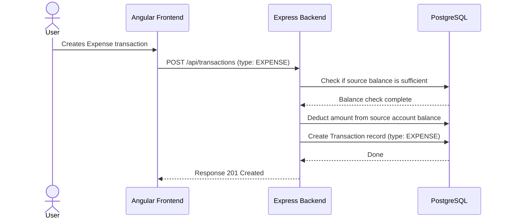

#### Module 8: Reference, feedbacks, and themes
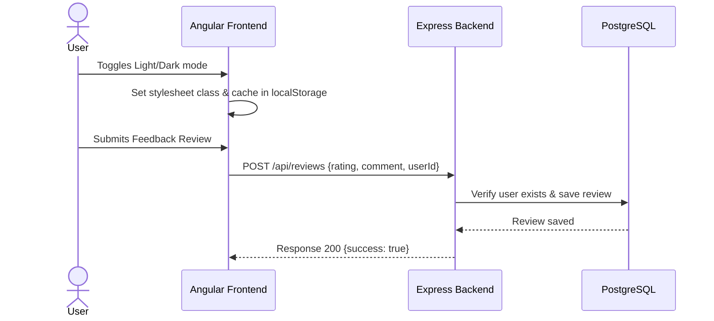

#### Module 9: Financial Dashboard
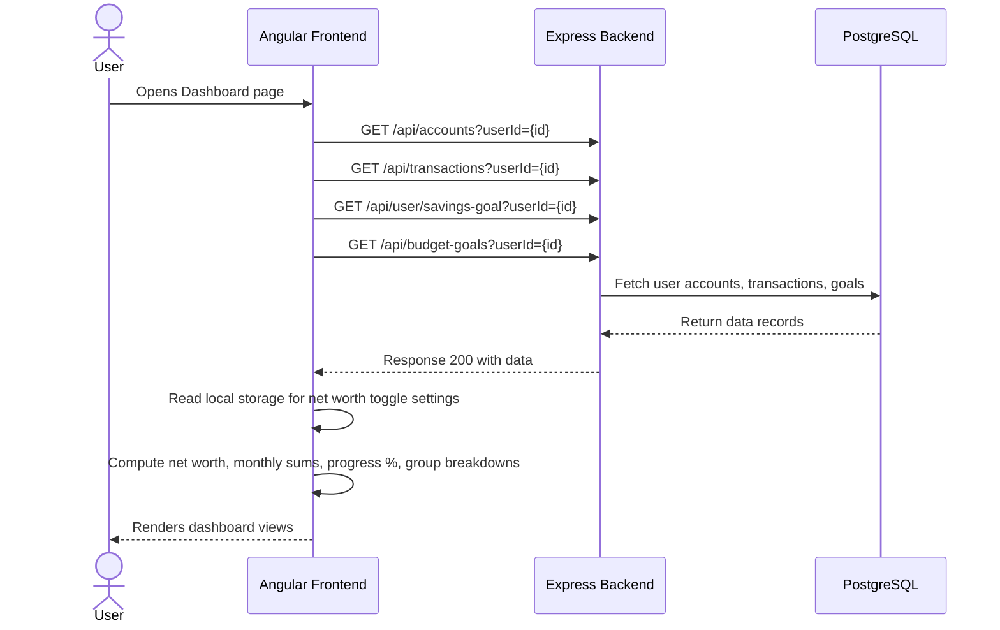

---

### 3.2 Flow charts (per core logic function)

#### 1. Authentication and security logic
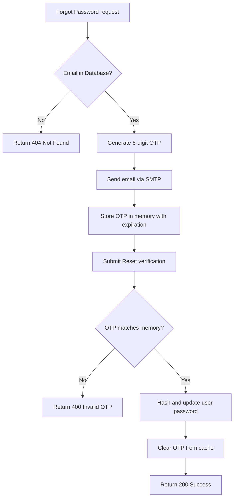

#### 2. Account balance update and auto-adjustment logic
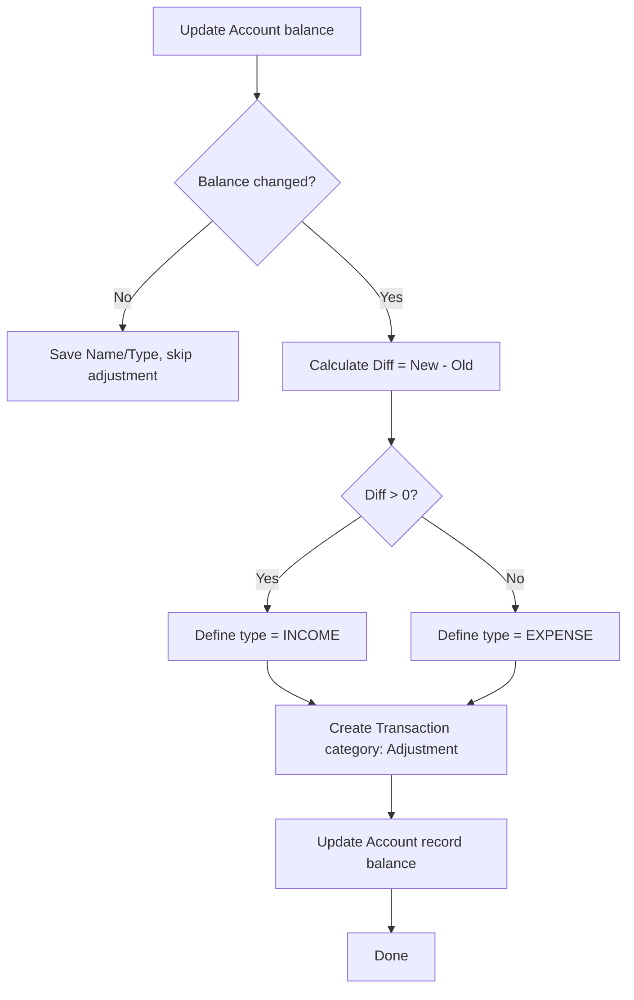

#### 3. Transaction posting funds verification
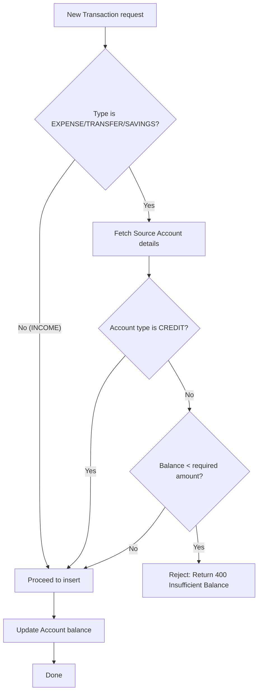

#### 4. Automated budget plan activation logic
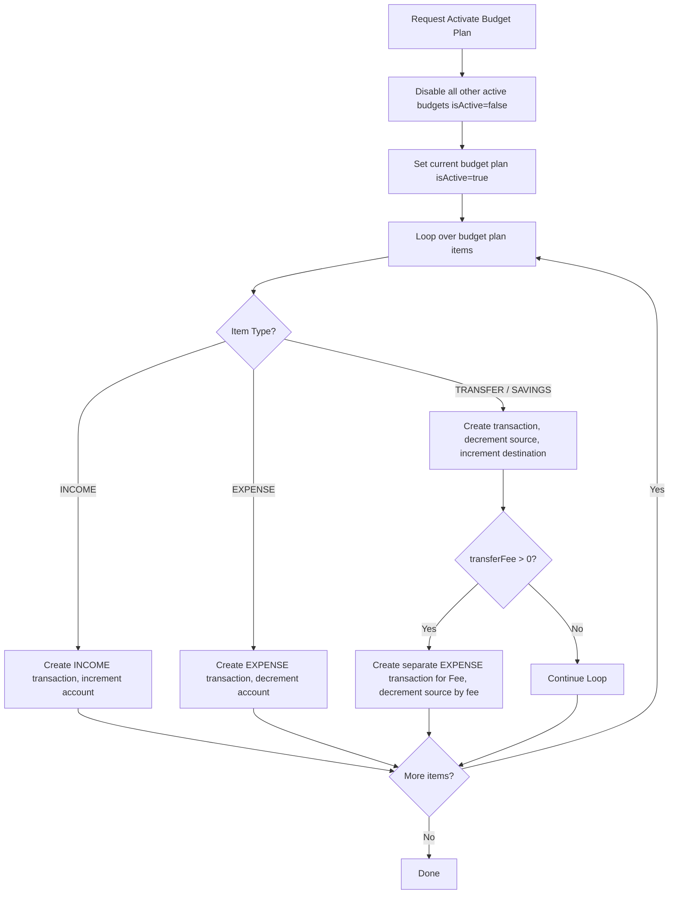

#### 5. Savings transaction and rollback logic
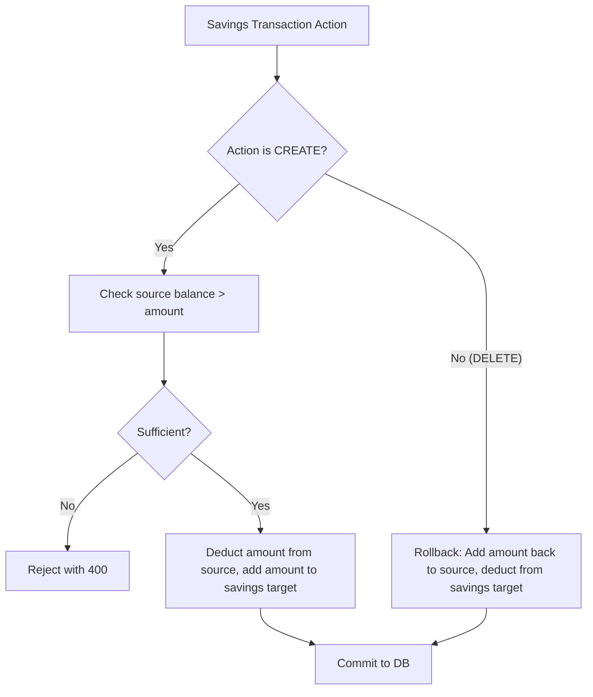

#### 6. Theme switching logic
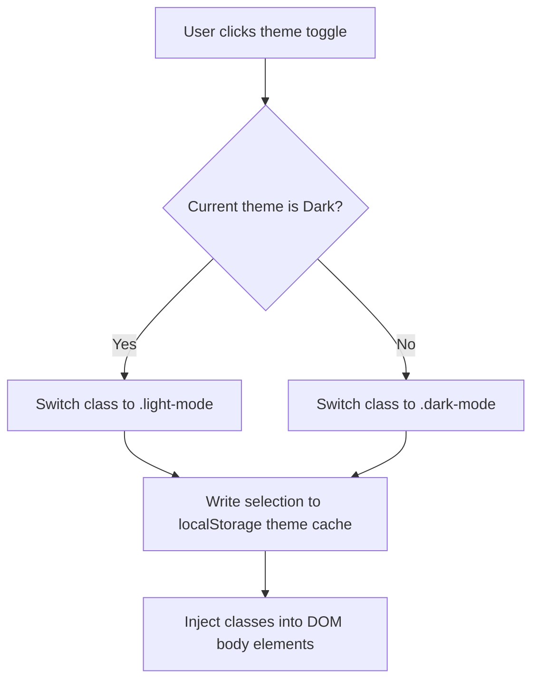

---

## 4. API endpoint design

### Unified endpoint configurations

#### Create endpoints
*   `POST /api/auth/register` (Register profile)
*   `POST /api/auth/login` (Create auth session)
*   `POST /api/auth/forgot-password` (Create OTP request)
*   `POST /api/accounts` (Create account)
*   `POST /api/transactions` (Create transaction: generic, savings, incomes, or expenses)
*   `POST /api/budget-plans` (Create budget plan)
*   `POST /api/budget-plans/:id/implement` (Activate budget plan)
*   `POST /api/reviews` (Create review)
*   `POST /api/refs/income-categories` (Create income category)
*   `POST /api/refs/expense-categories` (Create expense category)
*   `POST /api/refs/saving-categories` (Create savings category)

#### Listing and read endpoints
*   `GET /api/accounts?userId={userId}` (List accounts)
*   `GET /api/transactions?userId={userId}` (Get transaction list)
*   `GET /api/transactions?userId={userId}&type=SAVINGS` (GET savings list)
*   `GET /api/transactions?userId={userId}&type=INCOME` (GET incomes list)
*   `GET /api/transactions?userId={userId}&type=EXPENSE` (GET expenses list)
*   `GET /api/budget-plans?userId={userId}` (List budget plans)
*   `GET /api/budget-goals?userId={userId}` (GET budget goals)
*   `GET /api/user/savings-goal?userId={userId}` (GET monthly savings goal)
*   `GET /api/reviews` (List user reviews)
*   `GET /api/refs/income-categories` (List seeded income categories)
*   `GET /api/refs/expense-categories` (List seeded expense categories)
*   `GET /api/refs/saving-categories` (List seeded saving categories)
*   `GET /api/refs/account-types` (List account types)
*   `GET /api/refs/recurrence-intervals` (List recurrence intervals)

#### Update endpoints
*   `POST /api/auth/reset-password-otp` (Update password via OTP verification)
*   `POST /api/auth/reset-password` (Update password via authenticated verification)
*   `PUT /api/accounts/:id` (Update account)
*   `PUT /api/transactions/:id` (Update transaction / income / expense / savings details)
*   `PUT /api/budget-plans/:id` (Update budget plan)
*   `PUT /api/budget-plans/:id/deactivate` (Deactivate budget plan)
*   `PUT /api/budget-goals` (UPDATE budget goals)
*   `PUT /api/user/savings-goal` (UPDATE monthly savings goal)
*   `PUT /api/refs/income-categories/:id` (Update custom category name)
*   `PUT /api/refs/expense-categories/:id` (Update custom category name)
*   `PUT /api/refs/saving-categories/:id` (Update custom category name)

#### Delete endpoints
*   `DELETE /api/accounts/:id` (Delete account)
*   `DELETE /api/transactions/:id` (Delete transaction / savings / income / expense, triggers auto rollback)
*   `POST /api/transactions/bulk-delete` (Bulk delete transactions / savings / incomes / expenses)
*   `DELETE /api/budget-plans/:id` (Delete budget plan)
*   `DELETE /api/refs/income-categories/:id` (Delete unused category)
*   `DELETE /api/refs/expense-categories/:id` (Delete unused category)
*   `DELETE /api/refs/saving-categories/:id` (Delete unused category)

---

## 5. Complete entity relationship diagram (ERD)

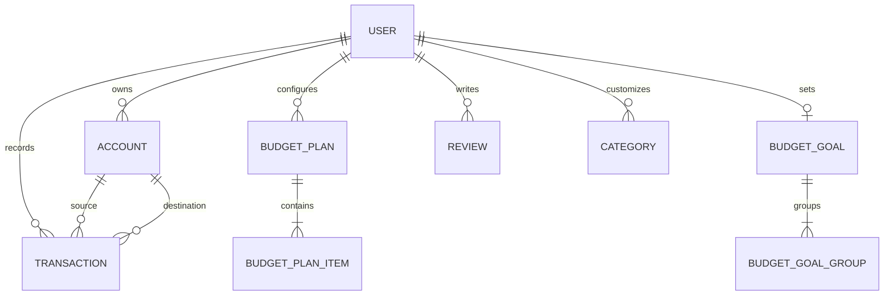

---

## 6. Data model (table per table specs)

---

### Table 1: User
Stores registration data and monthly goals.

| Column Name | Data Type | Description | Constraints |
| :--- | :--- | :--- | :--- |
| `id` | String | Unique identifier | PK, UUID, Default: UUID |
| `email` | String | Authenticated email address | Unique, Mandatory |
| `name` | String | Full name | Mandatory |
| `password` | String | Hashed credentials | Mandatory |
| `monthlySavingsGoal`| Float | Target monthly savings limit | Default: 0.0 |
| `createdBy` | String | Creator metadata | Nullable |
| `createdDate` | DateTime | Creation timestamp | Default: now() |
| `updatedBy` | String | Editor metadata | Nullable |
| `updatedDate` | DateTime | Last edit timestamp | Auto-updates on edit |

---

### Table 2: Account
Financial accounts (Cash, Banks, Credit Cards) configured by user.

| Column Name | Data Type | Description | Constraints |
| :--- | :--- | :--- | :--- |
| `id` | String | Unique identifier | PK, UUID, Default: UUID |
| `name` | String | Account display name | Mandatory |
| `type` | String | Repository Type | CASH, BANK, CREDIT, SAVINGS, E_WALLET |
| `balance` | Float | Actual balance | Default: 0.0 |
| `currency` | String | Currency type | Default: "PHP" |
| `userId` | String | Owning user reference | FK references User.id, Cascade Delete |
| `createdBy` | String | Creator metadata | Nullable |
| `createdDate` | DateTime | Creation timestamp | Default: now() |
| `updatedBy` | String | Editor metadata | Nullable |
| `updatedDate` | DateTime | Last edit timestamp | Auto-updates on edit |

---

### Table 3: Transaction
Log records detailing incomes, expenses, savings actions, and internal bank transfers.

| Column Name | Data Type | Description | Constraints |
| :--- | :--- | :--- | :--- |
| `id` | String | Unique identifier | PK, UUID, Default: UUID |
| `description` | String | Log summary | Mandatory |
| `amount` | Float | Transaction amount | Mandatory |
| `transferFee` | Float | Associated fee cost | Default: 0.0 |
| `type` | String | Action Type | INCOME, EXPENSE, TRANSFER, SAVINGS |
| `expenseType` | String | Classification of expense | Nullable, Default: "VARIABLE" (FIXED/VARIABLE) |
| `category` | String | Mapped category | Mandatory |
| `date` | DateTime | Execution timestamp | Default: now() |
| `expenseDate` | DateTime | Custom expense timestamp | Nullable |
| `userId` | String | Transaction creator reference| FK references User.id, Cascade Delete |
| `accountId` | String | Source account | FK references Account.id, SetNull |
| `toAccountId` | String | Destination account for transfers| FK references Account.id, SetNull |
| `createdBy` | String | Creator metadata | Nullable |
| `createdDate` | DateTime | Creation timestamp | Default: now() |
| `updatedBy` | String | Editor metadata | Nullable |
| `updatedDate` | DateTime | Last edit timestamp | Auto-updates on edit |

---

### Table 4: Category
Custom category structures declared on the frontend.

| Column Name | Data Type | Description | Constraints |
| :--- | :--- | :--- | :--- |
| `id` | String | Unique identifier | PK, UUID, Default: UUID |
| `name` | String | Display name | Mandatory |
| `parentCategoryId` | String | Mapped parent category ID | FK references Category.id, Cascade Delete, Nullable |
| `userId` | String | Mapped user ID | FK references User.id, Cascade Delete |
| `createdBy` | String | Creator metadata | Nullable |
| `createdDate` | DateTime | Creation timestamp | Default: now() |
| `updatedBy` | String | Editor metadata | Nullable |
| `updatedDate` | DateTime | Last edit timestamp | Auto-updates on edit |

---

### Table 5: BudgetPlan
Blueprints outlining projected monthly financial operations.

| Column Name | Data Type | Description | Constraints |
| :--- | :--- | :--- | :--- |
| `id` | String | Unique identifier | PK, UUID, Default: UUID |
| `name` | String | Blueprint name | Mandatory |
| `timeframe` | String | Mapped timeframe settings | Mandatory (JSON String) |
| `startDate` | DateTime | Active phase start | Nullable |
| `endDate` | DateTime | Active phase end | Nullable |
| `isActive` | Boolean | Active status flag | Default: false |
| `implementedAccountId`| String | Mapped default account ID | Nullable |
| `userId` | String | Blueprint owner | FK references User.id, Cascade Delete |
| `createdBy` | String | Creator metadata | Nullable |
| `createdDate` | DateTime | Creation timestamp | Default: now() |
| `updatedBy` | String | Editor metadata | Nullable |
| `updatedDate` | DateTime | Last edit timestamp | Auto-updates on edit |

---

### Table 6: BudgetPlanItem
Specific details regarding projected allocations.

| Column Name | Data Type | Description | Constraints |
| :--- | :--- | :--- | :--- |
| `id` | String | Unique identifier | PK, UUID, Default: UUID |
| `type` | String | Allocation Type | INCOME, EXPENSE, SAVINGS, TRANSFER |
| `categoryName` | String | Mapped category | Mandatory |
| `amount` | Float | Target amount | Mandatory |
| `accountId` | String | Target source account | Nullable |
| `toAccountId` | String | Target destination account | Nullable |
| `transferFee` | Float | Target fee | Nullable |
| `budgetPlanId` | String | Owning plan ID | FK references BudgetPlan.id, Cascade Delete |
| `createdBy` | String | Creator metadata | Nullable |
| `createdDate` | DateTime | Creation timestamp | Default: now() |
| `updatedBy` | String | Editor metadata | Nullable |
| `updatedDate` | DateTime | Last edit timestamp | Auto-updates on edit |

---

### Table 7: RefIncomeCategory
Reference data seeding the list of income categories.

| Column Name | Data Type | Description | Constraints |
| :--- | :--- | :--- | :--- |
| `id` | String | Unique identifier | PK, UUID, Default: UUID |
| `name` | String | Category name | Unique, Mandatory |
| `description` | String | Category summary | Nullable |
| `isActive` | Boolean | Activity flag | Default: true |
| `createdBy` | String | Creator metadata | Nullable |
| `createdDate` | DateTime | Creation timestamp | Default: now() |
| `updatedBy` | String | Editor metadata | Nullable |
| `updatedDate` | DateTime | Last edit timestamp | Auto-updates on edit |

---

### Table 8: RefExpenseCategory
Reference data seeding the list of expense categories.

| Column Name | Data Type | Description | Constraints |
| :--- | :--- | :--- | :--- |
| `id` | String | Unique identifier | PK, UUID, Default: UUID |
| `name` | String | Category name | Unique, Mandatory |
| `description` | String | Category summary | Nullable |
| `isActive` | Boolean | Activity flag | Default: true |
| `createdBy` | String | Creator metadata | Nullable |
| `createdDate` | DateTime | Creation timestamp | Default: now() |
| `updatedBy` | String | Editor metadata | Nullable |
| `updatedDate` | DateTime | Last edit timestamp | Auto-updates on edit |

---

### Table 9: RefSavingCategory
Reference data seeding the list of savings categories.

| Column Name | Data Type | Description | Constraints |
| :--- | :--- | :--- | :--- |
| `id` | String | Unique identifier | PK, UUID, Default: UUID |
| `name` | String | Category name | Unique, Mandatory |
| `description` | String | Category summary | Nullable |
| `isActive` | Boolean | Activity flag | Default: true |
| `createdBy` | String | Creator metadata | Nullable |
| `createdDate` | DateTime | Creation timestamp | Default: now() |
| `updatedBy` | String | Editor metadata | Nullable |
| `updatedDate` | DateTime | Last edit timestamp | Auto-updates on edit |

---

### Table 10: RefAccountType
Pre-seeded account types.

| Column Name | Data Type | Description | Constraints |
| :--- | :--- | :--- | :--- |
| `id` | String | Unique identifier | PK, UUID, Default: UUID |
| `code` | String | Unique code identifier | Unique, Mandatory (CASH, BANK, etc.) |
| `label` | String | Account type label | Mandatory |
| `icon` | String | Emoji representation | Default: "🏦" |
| `sortOrder` | Int | Sort order | Default: 0 |
| `createdBy` | String | Creator metadata | Nullable |
| `createdDate` | DateTime | Creation timestamp | Default: now() |
| `updatedBy` | String | Editor metadata | Nullable |
| `updatedDate` | DateTime | Last edit timestamp | Auto-updates on edit |

---

### Table 11: BudgetGoal
Goal models holding allocation frameworks.

| Column Name | Data Type | Description | Constraints |
| :--- | :--- | :--- | :--- |
| `id` | String | Unique identifier | PK, UUID, Default: UUID |
| `userId` | String | Goal owner reference | Unique, FK references User.id, Cascade Delete |
| `createdDate` | DateTime | Creation timestamp | Default: now() |
| `updatedDate` | DateTime | Last edit timestamp | Auto-updates on edit |

---

### Table 12: BudgetGoalGroup
Allocated percentage segments mapped inside a parent BudgetGoal (e.g. Needs, Wants).

| Column Name | Data Type | Description | Constraints |
| :--- | :--- | :--- | :--- |
| `id` | String | Unique identifier | PK, UUID, Default: UUID |
| `name` | String | Segment display name | Mandatory (e.g. Necessity) |
| `percentage` | Float | Mapped percentage value | Mandatory |
| `categories` | String[] | Category names | Array of strings |
| `budgetGoalId` | String | Parent Goal reference | FK references BudgetGoal.id, Cascade Delete |

---

### Table 13: Review
Customer reviews and application feedback ratings.

| Column Name | Data Type | Description | Constraints |
| :--- | :--- | :--- | :--- |
| `id` | String | Unique identifier | PK, UUID, Default: UUID |
| `rating` | Int | Score value | Mandatory, Range: 1 to 5 |
| `comment` | String | Text commentary | Mandatory |
| `userId` | String | Author reference | FK references User.id, Cascade Delete |
| `createdDate` | DateTime | Creation timestamp | Default: now() |
